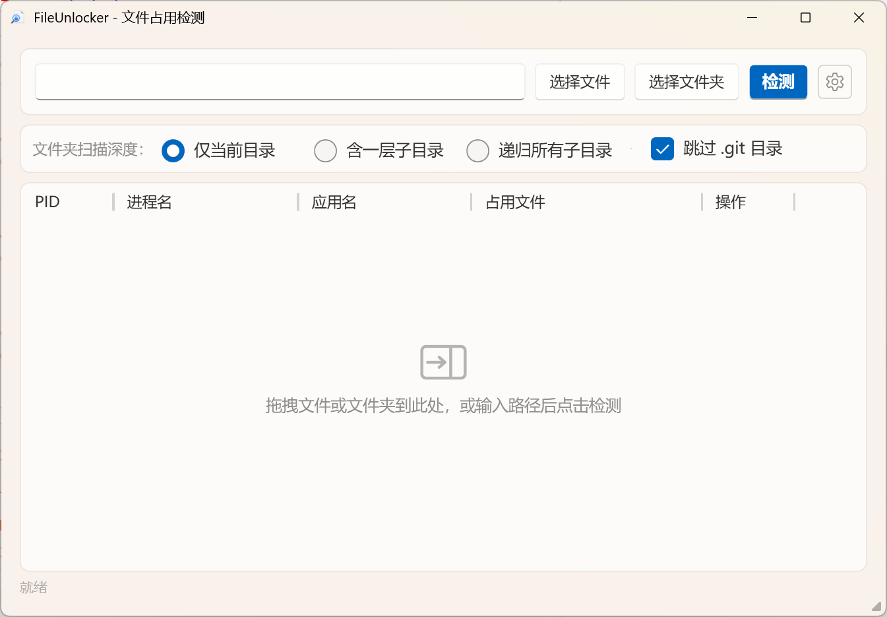
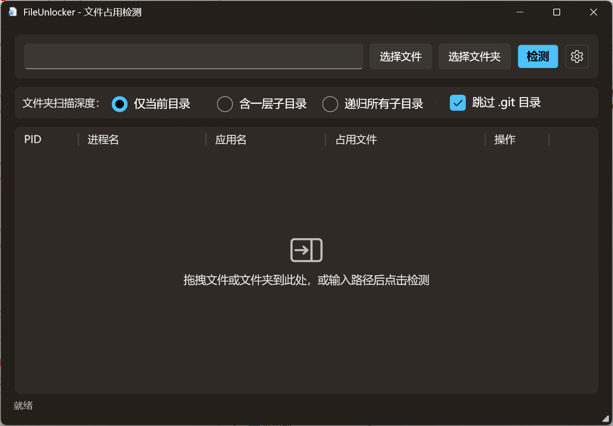

# FileUnlocker

轻量级 Windows 文件占用检测工具，基于 .NET 10 / WPF & Fluent 主题构建。


## 截图

| 浅色 | 深色 |
|:---:|:---:|
|  |  |

## 功能

- **Fluent 主题** — 原生 Windows 11 Fluent 设计风格，支持浅色 / 深色 / 跟随系统
- **双引擎检测** — Restart Manager API + `NtQueryInformationFile`，结果准确
- **文件夹支持** — 可配置扫描深度（仅当前目录 / 含一层子目录 / 递归所有子目录）
- **占用文件追踪** — 显示具体哪个文件被哪个进程占用
- **一键结束进程** — 快速释放被锁定的文件
- **异步并行** — UI 不卡顿，多核并行扫描
- **跳过 .git** — 可选排除 .git 目录
- **自身进程检测** — 检测自身 exe 占用也会显示
- **中英文切换** — 即时切换，设置持久化
- **设置窗口** — 语言和主题切换，保存/取消按钮
- **设置持久化** — 语言、主题、扫描深度、.git 选项保存至 `%APPDATA%\FileUnlocker\settings.json`

## 下载

克隆并使用 .NET 10 SDK 构建：

```bash
git clone https://github.com/0x574859/FileUnlocker.git
cd FileUnlocker
dotnet build -c Release
```

输出位于 `bin/Release/net10.0-windows/`。

## 使用方法

1. 输入文件/文件夹路径，或拖拽到窗口
2. 点击 **检测**
3. 查看占用进程 — 鼠标悬停 ℹ 图标可查看程序路径
4. 点击 **结束** 终止占用进程
5. 点击 ⚙ 打开设置 — 切换语言或主题

## 开源协议

本项目基于 [MIT 协议](LICENSE) 开源。

---

[English README](README.md)

## 致谢

使用 [OpenCode](https://opencode.ai) / GLM 5.1 Vibe Coding 而成，感谢 Zhoumo API。
